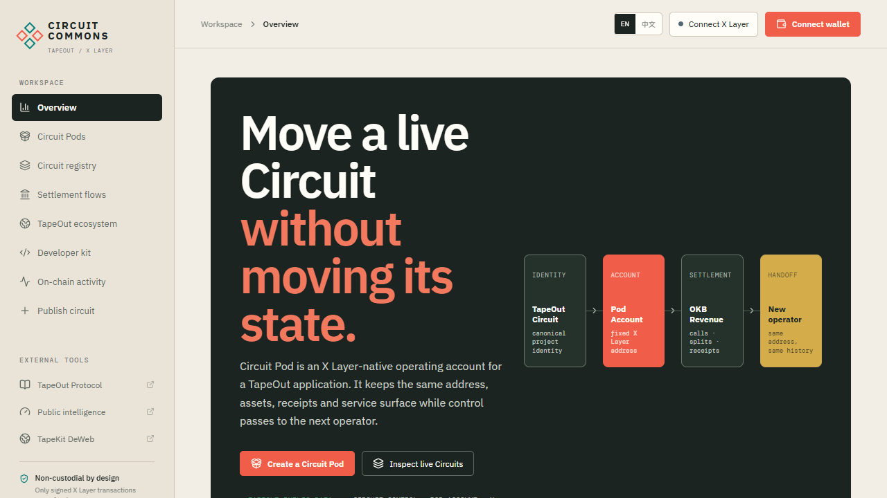
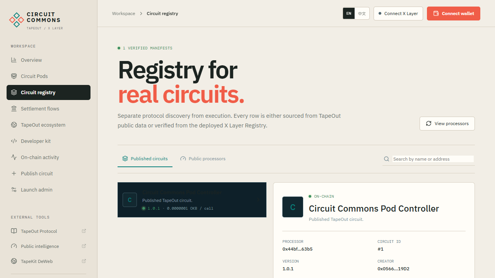

# Circuit Commons

**The operating and handoff layer for TapeOut applications on X Layer.**

Circuit Commons packages a real TapeOut Circuit, its official Container, a stable Pod Account, service configuration, assets, revenue rights and operating history into one transferable on-chain application unit.

[Open the live app](https://yanwenzhe519-ctrl.github.io/tapeout-circuit-commons/) · [Read the judge guide](docs/JUDGE_GUIDE.md) · [Inspect the deployment](deployments/xlayer-mainnet.json) · [View the Manifest](public/manifests/circuit-1-v1.0.1.json)

## The problem

A TapeOut Circuit can be permanent and transferable, but the application around it is normally fragmented across unrelated addresses and systems. The Circuit identifies the compute, the Container hosts the DeWeb surface, a treasury holds assets and revenue, configuration lives in off-chain files, and the current operator holds deployment permissions. Transferring only the Circuit can therefore break the application or strand its assets.

## The product

Circuit Commons creates a Circuit Pod with a stable X Layer address. Its controller is resolved from TapeOut's canonical Circuit ownership, so ownership can change while the Pod address, assets and history stay in place. This is not a file-notarization service and not another domain marketplace. It is an executable lifecycle protocol:

1. Verify the real Circuit owner and official Container.
2. Create one stable Pod Account for the Circuit.
3. Publish a content-addressed Manifest with pricing and revenue policy.
4. Route paid Circuit execution through X Layer and emit auditable receipts.
5. Credit creator, Processor and Pod revenue using pull payments.
6. Transfer the Circuit and verify that the same Pod, Container, Manifest and revenue account are controlled by the new owner.

## Architecture

~~~mermaid
flowchart LR
    C[TapeOut Circuit] --> O[Canonical ownerOf]
    C --> T[Official Container]
    O --> P[Stable Pod Account]
    T --> P
    M[Versioned Manifest] --> R[Commons Registry]
    P --> R
    U[User pays OKB] --> X[Commons Router]
    X --> E[TapeOut Processor eval]
    X --> Q[UsageReceipt]
    X --> S[Creator / Processor / Pod splits]
    O -. ownership changes .-> N[New operator]
    N --> P
~~~

## What judges can verify in three minutes

Open the [live app](https://yanwenzhe519-ctrl.github.io/tapeout-circuit-commons/) without a wallet, inspect Circuit registry and Circuit Pods, then run the release verifier:

~~~bash
npm install
cp .env.example .env.local
npm run verify:release
~~~

This validates the production build, X Layer chain ID 196, deployed bytecode, official Container state, Pod binding and the public Manifest hash. The full narrative and competition evidence are in [SUBMISSION.md](SUBMISSION.md) and [docs/JUDGE_GUIDE.md](docs/JUDGE_GUIDE.md).

## Production state

Verified on September 28, 2026. The X Layer Registry, Router, Factory, official Container, stable Pod Account and active Manifest are deployed and verified. The public GitHub Pages app is available for read-only inspection. The TapeKit identity is reserved but its activation payment is still pending. The first user-signed paid receipt and real Circuit handoff are final demo evidence still to be recorded; the repository does not present a simulation as a completed transaction.

## X Layer addresses

| Component | Address |
| --- | --- |
| Registry | 0xcCc8087Ef66f4728efCf18A9e785A05B4e10639B |
| Router | 0x2eC64f0Fc64Fc4856Ab1f580D87823A39a580119 |
| Pod Factory | 0x695AB5f2718ae631fE7C4FD79cEC93EE3Dbbf3e8 |
| TapeOut Processor / ownership adapter | 0x44bf1283199f080fd3cfaeaa01b8650859fe63b5 |
| Container adapter | 0x536add8f30f03b69f6fbf29d425a816a0dc50106 |
| Circuit #1 Container | 0x25A1D87789aE72E326B3A987F610F08219aA0764 |
| Circuit #1 Pod Account | 0x5FeB9c3884Cf69b0A960087E66d3b6638BE00eb6 |

## Why it fits the competition

Circuit Commons combines a clear application scenario with deep TapeOut integration and a real X Layer settlement layer. The Circuit and its official Container are verified on-chain; the Pod preserves the operating boundary across ownership transfer; the Router turns usage into receipts and explicit creator, Processor and Pod revenue; and the UI guides a creator through setup while keeping ordinary inspection wallet-free. The economic design uses a Circuit Pod account rather than a speculative token, and the contracts enforce owner checks, exact prices, bounded splits, pull withdrawals and reentrancy protection.

## Repository map

| Path | Purpose |
| --- | --- |
| contracts/ | Registry, Router, Factory, Pod Account and optional Revenue Vault |
| src/ | Product UI and X Layer integration |
| script/ | Foundry deployment and configuration scripts |
| scripts/ | Build, Manifest, deployment and verification tooling |
| test/ | Solidity regression tests |
| public/manifests/ | Public Circuit Manifest |
| deployments/ | Auditable mainnet deployment metadata |
| publisher.html | Wallet-connected TapeKit DeWeb publisher |

## Local development

~~~bash
npm install
cp .env.example .env.local
npm run dev
~~~

The application fails closed when required addresses are absent. Private keys are never accepted by the frontend. With Foundry installed, run:

~~~bash
forge test -vvv
~~~

## Security scope

This is a mainnet prototype, not an independently audited custody product. The contracts use immutable trust anchors, canonical Circuit-owner checks, exact-price execution, bounded basis-point splits, pull-payment withdrawals and a reentrancy lock. See [SECURITY.md](SECURITY.md).

## Further reading

- [Hackathon submission](SUBMISSION.md)
- [Judge verification guide](docs/JUDGE_GUIDE.md)
- [Deployment guide](DEPLOYMENT.md)
- [Product design](DESIGN.md)
- [Demo video script](VIDEO_SCRIPT.md)

